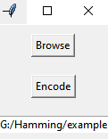
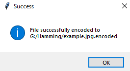
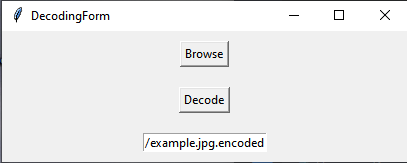
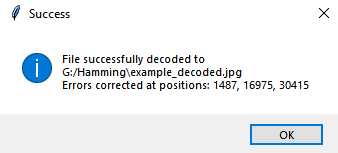

That's realization of Hamming-code (7,3). Hamming-code allows you to correct a single error (an error in one bit of a word)

You can use the hex-editor to make mistakes in file and check the algorithm operation

